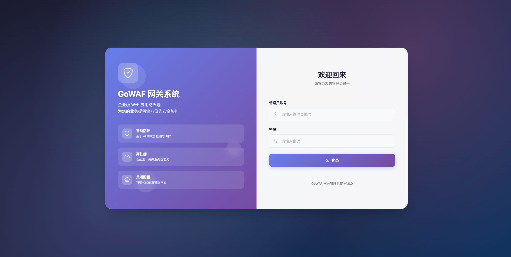
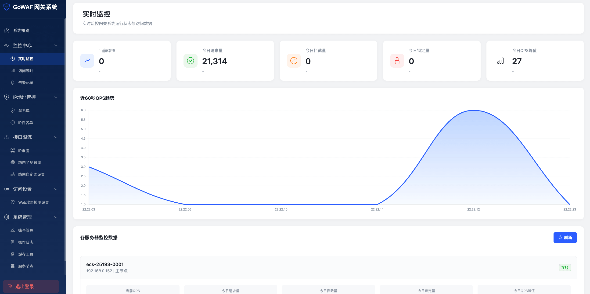

# GoWAF 系统描述文档

## 1. 系统概述

GoWAF 是基于 OpenResty + Lua 开发的 Web 应用防火墙（WAF）系统，提供全面的访问控制、流量限制、实时监控和告警功能。系统采用模块化设计，支持多租户架构，可灵活配置各种安全策略。

### 1.1 技术架构

- [安装教程](./INSTALL.md)
- **核心框架**：OpenResty (Nginx + LuaJIT)
- **编程语言**：Lua
- **数据存储**：
  - 共享字典（ngx.shared.DICT）：实时数据存储
  - MySQL：持久化数据存储
- **前端技术**：HTML5 + CSS3 + JavaScript + Bootstrap + Chart.js
- **系统截图**



### 1.2 专业版
- 开源版提供基础的防控能力，如需要更高的防控能力，建议升级到专业版
- 专业版提供路由级别防控规则功能，包括路由全局限流、路由自定义设置等
- 专业版还提供动态接口高并发访问功能，支持实时调整安全策略
- 专业版提供运维服务，定制规则，满足客户特定安全需求
- 专业版请联系：dhc.1229@163.com

### 1.3 目录结构

```
gowaf/
├── access/              # 用户端请求验证规则模块
│   ├── ip_black.lua     # IP黑名单验证
│   ├── ip_white.lua     # IP白名单验证
│   ├── ip_limit.lua     # IP限流（单IP、IP网段）
│   ├── sql_injection.lua  # SQL注入攻击检测
│   ├── xss_attack.lua   # XSS攻击检测
│   ├── web_attack.lua   # 通用Web攻击检测
│   ├── user_agent_check.lua  # User-Agent检查
│   └── main.lua         # 访问控制主入口
├── admin/               # 管理后台模块
│   ├── api/             # 后端API接口
│   │   ├── account.lua         # 账户管理
│   │   ├── alert.lua           # 告警管理
│   │   ├── blacklist.lua       # 黑名单管理
│   │   ├── cache.lua           # 缓存管理
│   │   ├── login.lua           # 登录认证
│   │   ├── monitor.lua         # 监控数据
│   │   ├── operation_log.lua   # 操作日志
│   │   ├── settings.lua        # 系统设置
│   │   ├── stat.lua            # 统计数据
│   │   ├── system.lua          # 系统管理
│   │   └── whitelist.lua       # 白名单管理
│   ├── html/            # 前端页面
│   │   ├── css/         # 样式文件
│   │   ├── js/          # JavaScript文件
│   │   └── lib/         # 第三方库
│   └── dbsql/           # 数据库脚本
├── core/                # 核心功能模块
│   ├── alert.lua        # 告警采集
│   ├── alert_config.lua # 告警配置
│   ├── config_manager.lua  # 配置管理
│   ├── func.lua         # 工具函数
│   ├── init.lua         # 系统初始化
│   ├── lib.lua          # 核心库
│   ├── redis.lua        # Redis操作
│   ├── stat.lua         # 统计功能
│   └── tool.lua         # 工具类
├── conf/                # 配置文件
├── resty/               # Resty库文件
├── main.lua             # 主入口文件
├── log.lua              # 日志处理（log_by_lua_file阶段）
```

---

## 2. 核心功能模块

### 2.1 访问控制模块（access/）

#### 2.1.1 SQL注入攻击检测（sql_injection.lua）
- **功能**：检测并拦截SQL注入攻击
- **实现**：基于规则匹配和模式识别

#### 2.1.2 XSS攻击检测（xss_attack.lua）
- **功能**：检测并拦截XSS攻击
- **实现**：基于规则匹配和模式识别

#### 2.1.3 通用Web攻击检测（web_attack.lua）
- **功能**：检测并拦截其他Web攻击
- **实现**：基于规则匹配和模式识别

#### 2.1.4 User-Agent检查（user_agent_check.lua）
- **功能**：检测异常User-Agent
- **实现**：基于规则匹配

#### 2.1.5 IP白名单验证（ip_white.lua）
- **功能**：验证请求IP是否在白名单中
- **优先级**：最高，白名单IP直接放行
- **配置**：支持从数据库加载白名单

#### 2.1.6 IP黑名单验证（ip_black.lua）
- **功能**：验证请求IP是否在黑名单中
- **处理**：黑名单IP直接拦截
- **配置**：支持从数据库加载黑名单

#### 2.1.7 IP限流（ip_limit.lua）
- **单IP限流**：
  - 检查时间窗口内单个IP的访问频率
  - 超过阈值则拦截并记录
  - 支持自定义检查时间、访问次数、封禁时间

---

### 2.2 统计监控模块

#### 2.2.1 QPS统计（stat.lua）
- **实时QPS统计**：
  - 每秒记录一次QPS数据
  - 数据存储在共享字典中，过期时间60秒
  - 支持查询最近60秒的QPS趋势
- **实现方式**：
  - 在log_by_lua_file阶段执行统计
  - 避免影响请求响应时间
  - 使用时间戳作为key，确保数据准确性

#### 2.2.2 今日统计（log.lua）
- **统计维度**：
  - 今日请求总量
  - 今日拦截量
  - 今日锁定量
- **存储方式**：
  - 使用共享字典存储实时数据
  - 按日期分组，每天独立统计
  - 数据过期时间24小时

#### 2.2.3 路由统计（log.lua）
- **功能**：统计每个路由的访问次数
- **应用场景**：
  - 识别热门路由
  - 分析流量分布
  - 发现异常访问
- **存储方式**：
  - 按日期和路由分组
  - 支持查询TOP10路由

---

### 2.3 告警系统（alert.lua）

#### 2.3.1 告警类型
- **攻击告警**：
  - SQL注入攻击
  - XSS攻击
  - 路径遍历攻击
  - 其他Web攻击
- **封禁告警**：
  - IP被封禁
  - IP网段被封禁
  - 路由被封禁
- **慢请求告警**：
  - 响应时间超过阈值的请求
  - 支持自定义慢请求阈值

#### 2.3.2 告警级别
- **高危**（high）：严重安全威胁，立即处理
- **中危**（medium）：潜在安全风险，及时处理
- **低危**（low）：一般安全事件，定期处理

#### 2.3.3 告警处理
- **处理操作**：
  - 标记为已读
  - 标记为已处理
  - 自动封禁IP（仅攻击告警）

---

### 2.4 管理后台模块

#### 2.4.1 用户认证（login.lua）
- **登录功能**：
  - 用户名密码登录
  - Token认证机制
  - Token有效期2小时
- **登出功能**：
  - 清除本地Token
  - 清除服务端Token缓存

#### 2.4.2 账户管理（account.lua）
- **功能**：
  - 查看管理员列表
  - 添加管理员
  - 修改管理员信息
  - 删除管理员
  - 修改密码

#### 2.4.3 IP管理
- **黑名单管理（blacklist.lua）**：
  - 查询黑名单IP
  - 添加黑名单IP
  - 删除黑名单IP
  - 批量导入黑名单
- **白名单管理（whitelist.lua）**：
  - 查询白名单IP
  - 添加白名单IP
  - 删除白名单IP
  - 批量导入白名单
- **IP控制（ip-control.html）**：
  - 统一的IP管理界面
  - 支持黑白名单切换

#### 2.4.6 监控中心
- **仪表盘（index.html）**：
  - 全网关QPS监控
  - 最近60秒QPS趋势图
  - 每3秒自动刷新
- **实时监控（realtime-monitor.html）**：
  - 近60秒QPS趋势图
  - 今日统计（请求量、拦截量、锁定量）
  - 路由TOP10（按访问次数排序）
  - 每3秒自动刷新
- **统计查询（stat-query.html）**：
  - 历史QPS查询（数据保留7天）
  - 每日请求量统计
  - 每日拦截量统计
  - 每日锁定量统计
  - 访问失败量统计

#### 2.4.7 告警管理（alert-log.html）
- **告警查询**：
  - 按告警类型筛选
  - 按告警级别筛选
  - 按状态筛选
  - 按时间范围筛选
- **告警处理**：
  - 标记为已读
  - 标记为已处理
  - 自动封禁IP

#### 2.4.8 操作日志（operation-log.html）
- **功能**：
  - 记录所有管理操作
  - 支持按时间、操作人、操作类型查询
  - 操作类型包括：登录、登出、配置修改、IP管理、路由管理等

#### 2.4.9 系统设置（system-settings.html）
- **功能**：
  - WAF开关控制
  - WAF模式配置（监控模式/拦截模式）
  - 全局限流配置
  - 告警阈值配置
  - 其他系统参数配置

#### 2.4.10 缓存管理（cache-tool.html）
- **功能**：
  - 查看缓存状态
  - 清空所有缓存
  - 清空过期缓存
  - 查看缓存Key列表

---

## 3. 数据流程

### 3.1 请求处理流程

```
1. Nginx接收请求
   ↓
2. access_by_lua_file阶段（main.lua）
   ↓
3. 初始化系统（core/init.lua）
   - 加载配置
   - 获取客户端IP
   - 获取租户信息
   ↓
4. 访问控制（access/main.lua）
   - IP白名单验证（ip_white.lua）→ 通过则放行
   - IP黑名单验证（ip_black.lua）→ 匹配则拦截
   - SQL注入攻击检测（sql_injection.lua）
   - XSS攻击检测（xss_attack.lua）
   - 通用Web攻击检测（web_attack.lua）
   - User-Agent检查（user_agent_check.lua）
   - IP限流（ip_limit.lua）
   ↓
5. 业务逻辑处理
   ↓
6. log_by_lua_file阶段（log.lua）
   - QPS统计（stat.lua）
   - 今日统计
   - 路由统计
   - 告警采集（alert.lua）
   ↓
7. 返回响应
```

### 3.2 管理后台请求流程

```
1. 浏览器发起请求
   ↓
2. Nginx接收请求
   ↓
3. access_by_lua_file阶段
   - 静态文件处理（core/tool.lua）
   ↓
4. admin/api/main.lua
   - Token验证
   - 路由匹配
   - 调用对应API方法
   ↓
5. 数据库操作
   ↓
6. 返回JSON响应
   ↓
7. 前端渲染
```

---

## 6. 安全特性

### 6.1 访问控制
- IP黑白名单
- 多级限流（IP、IP网段、路由）
- 租户隔离
- Token认证

### 6.2 防护能力
- 防止DDoS攻击
- 防止暴力破解
- 防止恶意爬虫
- 防止SQL注入
- 防止XSS攻击
- 防止路径遍历攻击

### 6.3 审计功能
- 操作日志记录
- 访问日志记录
- 告警记录
- 统计数据

---

## 7. 注意事项

1. **配置生效**：修改配置后实时生效，无需重载配置，只有Nginx重启后才需要重新加载配置
2. **缓存同步**：多服务器部署时，配置修改会自动同步到所有服务器
3. **数据保留**：历史统计数据保留7天，告警数据保留30天
4. **性能影响**：QPS统计在log_by_lua_file阶段执行，不影响请求响应时间
5. **内存管理**：共享字典大小需要根据实际访问量配置，避免内存溢出
6. **Token安全**：Token有效期2小时，建议定期更换密码
7. **服务器ID**：多服务器部署时，每台服务器需要设置唯一的SERVER_ID

---

## 8. 功能清单

### 8.1 访问控制
- [x] IP白名单验证
- [x] IP黑名单验证
- [x] 单IP限流
- [x] IP网段限流
- [x] SQL注入攻击检测
- [x] XSS攻击检测
- [x] 通用Web攻击检测
- [x] User-Agent检查

### 8.2 统计监控
- [x] 实时QPS统计
- [x] 今日请求统计
- [x] 今日拦截统计
- [x] 今日锁定统计
- [x] 路由访问统计
- [x] 路由TOP10
- [x] 历史QPS查询
- [x] 每日统计查询

### 8.3 告警系统
- [x] 攻击告警
- [x] 封禁告警
- [x] 慢请求告警
- [x] 告警查询
- [x] 告警标记
- [x] 告警处理
- [x] 自动封禁

### 8.4 管理后台
- [x] 用户登录/登出
- [x] 账户管理
- [x] IP黑名单管理
- [x] IP白名单管理
- [x] 限流配置
- [x] 仪表盘
- [x] 实时监控
- [x] 统计查询
- [x] 告警管理
- [x] 操作日志
- [x] 系统设置
- [x] 缓存管理

### 8.5 系统功能
- [x] 多租户支持
- [x] Token认证
- [x] 操作日志
- [x] 配置管理
- [x] 缓存管理
- [x] 数据持久化
- [x] 实时监控
- [x] 告警推送

---

**文档版本**：V1.1  
**最后更新**：2026-03-13  
**维护人员**：GoWAF Team
